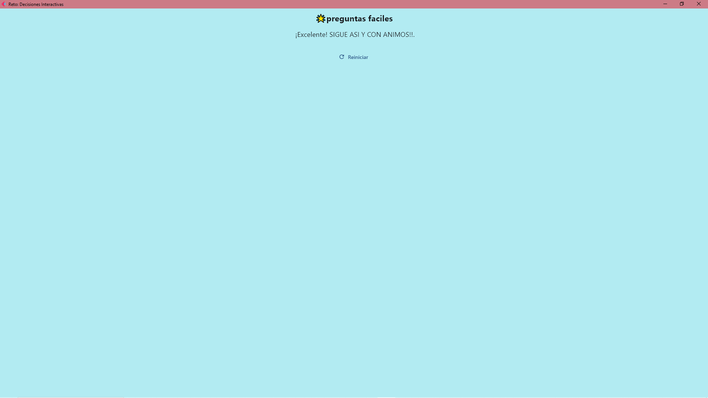

## Presentación: Reto - Decisiones Interactivas

### ¿Qué es este proyecto?
Es una aplicación interactiva hecha con Flet y Python, donde el usuario responde una serie de preguntas sobre su experiencia escolar. Según sus respuestas ("Sí", "No", "Tal vez"), la app lo lleva por diferentes caminos y finales.

---

### Estructura del código

- **main.py**: Archivo principal donde está toda la lógica.
- **Flet**: Framework para crear interfaces gráficas modernas en Python.

---

### Funciones principales

- **main(page)**  
  Inicializa la ventana, define los botones, textos y el flujo de la aplicación.

- **mostrar_inicio()**  
  Muestra la pregunta inicial y reinicia el estado.

- **a_preguntaX_si / a_preguntaX_talvez / a_preguntaX_no**  
  Cada una muestra la siguiente pregunta según la respuesta del usuario.

- **final_bueno / final_medio / final_malo / final_talvez**  
  Muestran mensajes finales según el camino recorrido.

- **on_si / on_no / on_tal**  
  Son los controladores de eventos para los botones. Según el estado actual, llaman a la función correspondiente para avanzar en la historia.

- **on_reset**  
  Permite reiniciar la aplicación y volver a la pregunta inicial.

---

### ¿Cómo funciona el flujo?

1. El usuario ve una pregunta y tres botones: "Sí", "No", "Tal vez".
2. Al presionar un botón, la app muestra la siguiente pregunta o un final, según la respuesta.
3. El flujo es lineal: cada respuesta lleva a una pregunta específica, sin mezclar caminos.
4. Al final, se muestra un mensaje motivacional, de reflexión o de cierre.

---

### ¿Para qué sirve?

- Para practicar lógica de decisiones.
- Para crear historias interactivas.
- Para aprender a usar Flet y Python en interfaces gráficas.

---

### mapa diagrafica del flujo


### inicio de reto


### final bueno



### final malo


### final tal vez


### final medio


## Requisitos

- Python 3.8 o superior (recomendado Python 3.10+)
- Flet 0.18.0 o superior

## Instalación

Abre una terminal en la carpeta del proyecto y ejecuta:

```
pip install flet
```

## Ejecución

1. Abre la terminal en la carpeta donde está el archivo `main.py`.
2. Ejecuta el siguiente comando:

```
python src/main.py
```

La aplicación se abrirá en una ventana gráfica.

---

Si tienes un archivo `requirements.txt` o `pyproject.toml`, puedes instalar todas las dependencias con:

```
pip install -r requirements.txt
```
o
```
pip install .
```